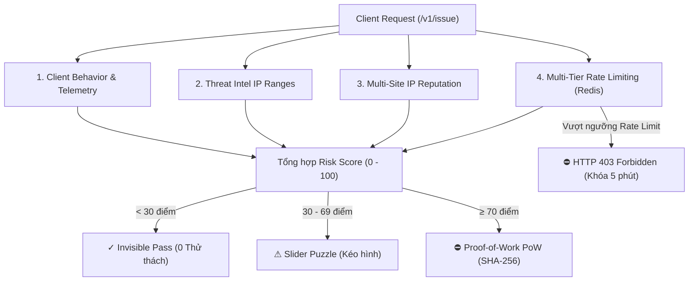

# Risk Engine — Cơ Chế Đánh Giá Rủi Ro & Chống Bot Đa Tầng

Tài liệu này mô tả chi tiết toàn bộ thuật toán chấm điểm rủi ro (Risk Scoring), các cửa sổ Rate Limiting trượt trên Redis, cơ chế chống bot lặp lại (Anti-Automation) và chính sách chặn cứng HTTP 403 Forbidden của VinaCaptcha.

---

## 1. Tổng Quan Kiến Trúc

Risk Engine hoạt động theo mô hình **Zero-Friction / Invisible First** (giống Google reCAPTCHA v3 / Cloudflare Turnstile):
- **Khách hàng thật (Điểm < 30):** Được cấp token hợp lệ ngay lập tức trong suốt (Invisible Pass) mà không bị làm phiền.
- **Nghi ngờ vừa (Điểm 30 - 69):** Leo thang yêu cầu giải Slider Puzzle (kéo mảnh ghép canvas).
- **Nguy cơ cao (Điểm 70 - 100):** Ép buộc giải thuật toán Proof-of-Work (SHA-256 Web Crypto) để làm nghẽn CPU bot farm.
- **Tần suất quá nhanh / Spam dồn dập (Rate Limit Exceeded):** Chặn cứng HTTP **403 Forbidden** và khóa IP 5 phút.



---

## 2. Chi Tiết 4 Trụ Cột Chấm Điểm

### 2.1. Client Behavior & Passive Telemetry (Hành vi thụ động)

Thu thập tự động từ Widget mà không cần tương tác người dùng:

| Tín hiệu Client | Điều kiện vi phạm | Điểm phạt / Thưởng | Ý nghĩa kỹ thuật |
| :--- | :--- | :--- | :--- |
| **Honeypot Field** | Input ẩn bị điền giá trị | **+80 điểm** | DOM Bot scraper tự động điền mọi input |
| **Webdriver Flag** | `navigator.webdriver === true` | **+60 điểm** | Selenium, Puppeteer, Playwright, Headless Chrome |
| **Virtual GPU** | GPU renderer chứa `SwiftShader`, `llvmpipe`, `Mesa`, `VirtualBox`, `VMware` | **+45 điểm** | Máy ảo server không có card đồ họa thật |
| **Tốc độ Submit** | `time_on_page_ms < 600ms`<br>`time_on_page_ms < 1500ms` | **+30 điểm**<br>**+15 điểm** | Bot điền form với tốc độ máy (sub-second) |
| **Tương tác Vật lý** | `mouse_moves === 0 && key_strokes === 0` | **+25 điểm** | Submit form nhưng chuột và phím hoàn toàn bất động |
| **Anti-Automation** | `execution_count > 1` không có chuột/phím mới<br>`execution_count > 1` cách nhau < 2s<br>`execution_count >= 3` | **+50 điểm**<br>**+35 điểm**<br>**+15 đến +40 điểm** | Vòng lặp script tự động submit liên tiếp nhiều lần |
| **Mâu thuẫn Phần cứng** | `screen_width === 0 \|\| screen_height === 0` | **+20 điểm** | Môi trường headless không có viewport màn hình |
| **Canvas Error** | `canvas_fingerprint === 'error'` | **+15 điểm** | Môi trường rút gọn thiếu thư viện đồ họa |
| **Human Bonus** | `mouse_moves > 10 && key_strokes > 3 && time_on_page_ms > 2500` ở lần đầu | **-10 điểm (Thưởng)** | Tương tác tự nhiên của người thật, ưu tiên Invisible |

---

### 2.2. Threat Intelligence (Danh sách đen IP)

Tra cứu trong bảng `threat_intel_ranges` (được sync định kỳ từ các nguồn mở uy tín):

| Nguồn Threat Intel | Danh mục | Điểm phạt |
| :--- | :--- | :--- |
| **Spamhaus DROP / AbuseIPDB** | `attacks`, `spam`, `malware` | **+80 điểm** |
| **Tor Project** | `tor` (Tor Exit Node) | **+60 điểm** |
| **Cloud Providers** | `datacenter` (AWS, GCP, Azure, DigitalOcean) | **+35 điểm** |

---

### 2.3. IP Reputation (Uy tín liên-site)

Học máy và tích lũy lịch sử vi phạm dùng chung trên toàn hệ thống (`ip_reputation`):

| Chỉ số vi phạm | Điều kiện | Điểm phạt |
| :--- | :--- | :--- |
| **Fail Count** | $\ge 10$ lần thất bại liên tiếp<br>$\ge 5$ lần thất bại<br>$\ge 2$ lần thất bại | **+50 điểm** (Đánh dấu Banned)<br>**+35 điểm**<br>**+15 điểm** |
| **Multi-Site Penalty** | Xuất hiện vi phạm trên $\ge 2$ website khác nhau | **Nhân $1.5\times$ điểm phạt** |

---

### 2.4. Multi-Tier Rate Limiting (Tần suất đa tầng Redis)

Đo lường vận tốc request của IP trên **3 cửa sổ trượt song song** trong Redis $O(1)$ in-memory:

| Cửa sổ thời gian | Redis Key Pattern | TTL | Ngưỡng vi phạm & Điểm số |
| :--- | :--- | :--- | :--- |
| **10 giây (Burst)** | `ratelimit:issue:10s:{ip}` | **10s** | - $> 20$ req/10s: **+70 điểm** (Kích hoạt Chặn 403)<br>- $> 10$ req/10s: **+45 điểm**<br>- $> 4$ req/10s: **+25 điểm** |
| **5 phút (Low & Slow)** | `ratelimit:issue:5m:{ip}` | **300s** | - $> 15$ req/5m: **+80 điểm**<br>- $> 6$ req/5m: **+60 điểm** (Kích hoạt Chặn 403 - Khóa 5m)<br>- $> 3$ req/5m: **+35 điểm** |
| **1 giờ (Scraping)** | `ratelimit:issue:1h:{ip}` | **3600s** | - $> 60$ req/1h: **+60 điểm** (Kích hoạt Chặn 403)<br>- $> 30$ req/1h: **+35 điểm** |

---

## 3. Chính Sách Chặn Cứng HTTP 403 Forbidden

Khi IP thỏa mãn điều kiện vượt ngưỡng:
$$\text{isRateLimitExceeded} = (\text{count5m} > 6) \lor (\text{count10s} > 20) \lor (\text{count1h} > 60) \lor (\text{rateLimitScore} \ge 60)$$

1. **API `/v1/issue`:** Lập tức ném exception **`403 Forbidden`** với JSON chuẩn:
   ```json
   {
     "error": {
       "code": "rate_limit_exceeded",
       "message": "Thao tác quá nhanh, vui lòng thử lại sau."
     }
   }
   ```
2. **Audit Logging:** Ghi log vi phạm với `result = 'fail'`, `challenge_type = 'none'` vào `verification_logs` và tăng tracking `verify_fail`.
3. **Khóa tạm thời:** Cửa sổ trượt Redis giữ trạng thái khóa trong suốt thời gian TTL (5 phút cho cửa sổ 5m).
4. **Widget Client:** Bắt mã `rate_limit_exceeded`, dừng submit form ngay lập tức (không fail-open) và hiển thị cảnh báo đỏ *"Thao tác quá nhanh"*.

---

## 4. Bảng Ma Trận Phân Loại Thử Thách (Escalation Matrix)

$$\text{Total Score} = \min\Big(100, \max\big(0, S_{\text{client}} + S_{\text{threat}} + S_{\text{reputation}} + S_{\text{ratelimit}}\big)\Big)$$

| Mức độ Rủi ro | Điểm số / Trạng thái | Hành động Captcha | Trải nghiệm Người Dùng |
| :--- | :--- | :--- | :--- |
| **Low Risk** | $0 \le \text{Score} < 30$ | **Invisible Pass** | 100% trong suốt, cấp token tức thì |
| **Medium Risk** | $30 \le \text{Score} < 70$ | **Slider Puzzle** | Popup trượt mảnh ghép (hỗ trợ chuột & touch mobile) |
| **High Risk** | $70 \le \text{Score} \le 100$ | **Proof-of-Work (PoW)** | Trình duyệt giải SHA-256 (Độ khó 12 - 18 bits) |
| **Rate Limit Exceeded** | Vượt ngưỡng tần suất | **403 Forbidden** | Chặn submit, khóa 5 phút |
